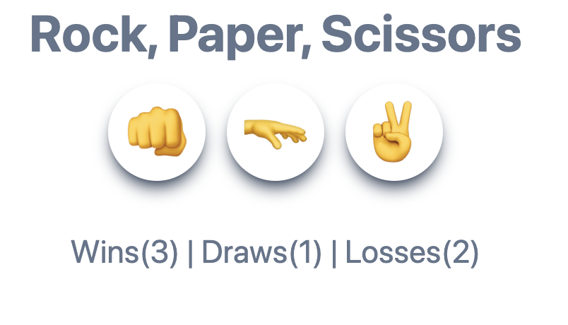
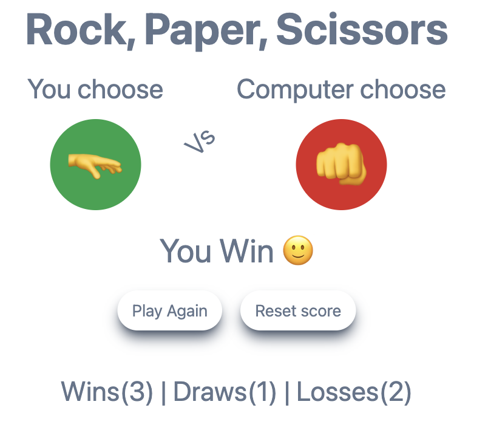

# Rock, Paper, Scissors Game

## Description

A simple Rock, Paper, Scissors game built with Vue.js. The app allows users to play against the computer, with the game results (win, lose, draw) tracked and stored in the browser's local storage.

Try it [here](https://rock-pepper-scissors.vercel.app/).

## Features

- Play Rock, Paper, Scissors against the computer
- Track wins, losses, and draws
- Responsive design
<!-- - Mobile app support using Capacitor -->

## Screenshots

## 📀 Tech stack
- Vue.js
- Tailwind CSS
- Javascript
- HTML
- Vite

## License

This project is licensed under the MIT License - see the [LICENSE](LICENSE) file for details.

